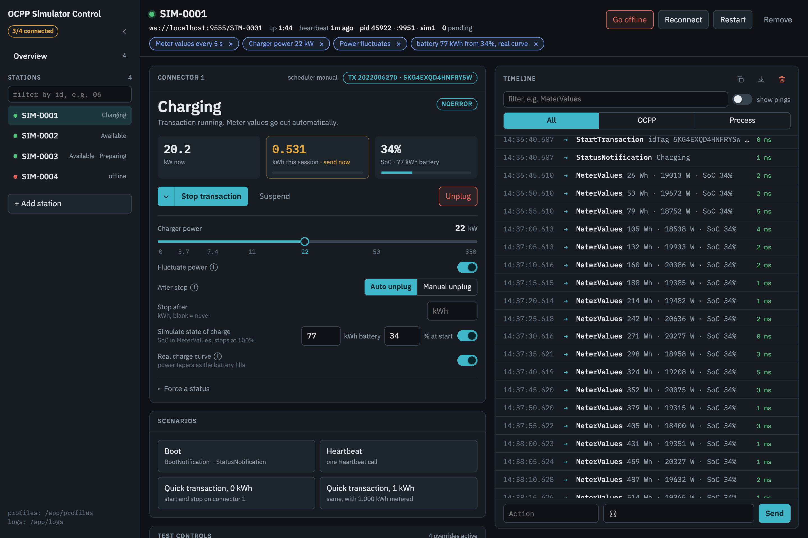

# OCPP Simulators

A web control panel for a fleet of virtual OCPP charge points: start stations, plug in a car,
run a session, inject faults and watch every frame, without touching hardware.



## Built on OCPP Virtual Charge Point

The charge point itself is [**OCPP Virtual Charge Point**](https://github.com/solidstudiosh/ocpp-virtual-charge-point)
by [Solidstudio](https://solidstudio.io), originally written by Krzysztof Ciombor and released under the
[Apache License 2.0](LICENSE). The OCPP 1.6, 2.0.1 and 2.1 message handling, schema validation, admin
commands and the terminal workflow below are their work, and all credit for the simulator core goes
to them. This repository is a fork; our changes are listed in its git history.

## Why this fork

At [EOSVOLT](https://eosvolt.com) we test our charging platform every day against chargers that are
slow, flaky, offline or just plain unusual. A terminal per station did not scale to that, so we built
a visual layer on top of the simulator:

- **Fleet panel.** Add and remove stations from the browser. The panel writes each station's profile,
  runs its process and restarts it when it exits.
- **Connector as a state machine.** Plug in, authorize, start, suspend, stop with any OCPP stop
  reason, and unplug. Only the actions that fit the current status are offered.
- **Realistic energy.** Set the charger power from 0 to 350 kW. You can let it fluctuate, simulate the
  battery's state of charge, and have the power taper off as the battery fills.
- **Test controls.** Delay replies or remote command handling, ignore or reject RemoteStart for a while,
  raise plug faults, take a station offline and bring it back.
- **Timeline.** Every OCPP call paired with its answer, merged with the process log. Filter it, then
  copy or download it as raw frames.

## Quick start

You need Node.js 20 or newer and a CSMS for the stations to connect to.

```bash
npm install
AUTO_EXCLUDE_CP_IDS='*' WS_URL=ws://localhost:9000 npm run web
```

Open <http://127.0.0.1:8080> and use **Add station**. Every station connects to
`<WS_URL>/<station id>`, so the id must be known to your CSMS.

### Docker

```bash
docker build -t ocpp-simulators .
docker run -p 8080:8080 \
  -e WS_URL=ws://host.docker.internal:9000 \
  -v ocpp-sim-profiles:/app/profiles -v ocpp-sim-logs:/app/logs \
  ocpp-simulators
```

The volumes keep stations and logs across restarts. `OCPP_SIM_STATIONS=SIM-0001,SIM-0002` creates
those stations on the first start. In Spark's dev stack the simulator is the `ocpp_simulator` service.
Code is baked into the image, so rebuild it after a change:

```bash
docker compose --profile simulator up -d --build --no-deps ocpp_simulator
```

### Configuration

| Variable | Default | |
| --- | --- | --- |
| `WS_URL` | `ws://localhost:9000` | CSMS endpoint for new stations |
| `WEB_PORT` / `WEB_HOST` | `8080` / `127.0.0.1` | where the panel listens (`0.0.0.0` in Docker) |
| `AUTO_EXCLUDE_CP_IDS` | empty (`*` in Docker) | test chargers: no automatic sessions, full test controls; `*` for all |
| `TOKEN` | `SIMTAG1` in Docker | idTag a station authorizes with when none is given |
| `SIM_PROFILES_DIR` / `SIM_LOG_DIR` | repo root / `logs/` | station profiles (`.env.sim<N>`) and their logs |
| `SIM_ADMIN_PORT_BASE` | `9901` | first admin API port handed to a new station |

## From the terminal

The original workflow still works: one station per process, configured by env vars or an env file.

```bash
WS_URL=ws://localhost:9000 CP_ID=SIM-0001 npm start index_16.ts   # OCPP 1.6
WS_URL=ws://localhost:9000 CP_ID=SIM-0001 npm start index_201.ts  # OCPP 2.0.1
npm start production index_16.ts                                  # reads .env.production
```

A running station exposes an admin API. Charge point initiated messages are sent with the commands in
`admin/`, and `__TOKEN__` in them is replaced with the station's `TOKEN`:

```bash
npx tsx admin/v16/Authorize/authorize.ts
npx tsx admin/v16/Transaction/startTransaction.ts
npx tsx admin/v16/Transaction/stopTransaction.ts
```

The same API is what the panel drives, so everything is scriptable. A terminal station listens on
`ADMIN_PORT` (9999 by default); a panel station shows its port in the header (9901 for the first):

```bash
curl -s localhost:9901/health
curl -s -X POST localhost:9901/charging-power -H 'content-type: application/json' -d '{"kw": 11}'
curl -s -X POST localhost:9901/connector-action -H 'content-type: application/json' -d '{"connectorId": 1, "action": "plug_in"}'
```

For connecting to Spark and Cosmos, the delay clocks, meter values, scenarios and the full admin API,
see [docs/spark-and-cosmos.md](docs/spark-and-cosmos.md).

## Development

```bash
npm run check   # lint, format check, typecheck
```

## License

[Apache License 2.0](LICENSE). Original work copyright Solidstudio, modifications copyright EOSVOLT.
